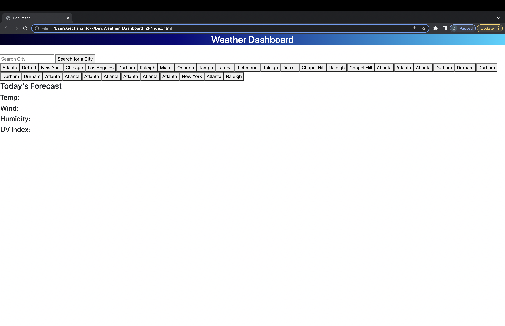

Added button to search for city

Added function so that current and future conditions for that city and city is added to search history

Created function that displays city name, date and weather conditions

Added icons to represent weather conditions and color that indicates UV Index is favorable, moderate or severe

Created 5 day forecast that displays date, icon, temperature, wind speed, humidity

Created function that allows user to click on a city in the search history to see current and future conditions for that city

